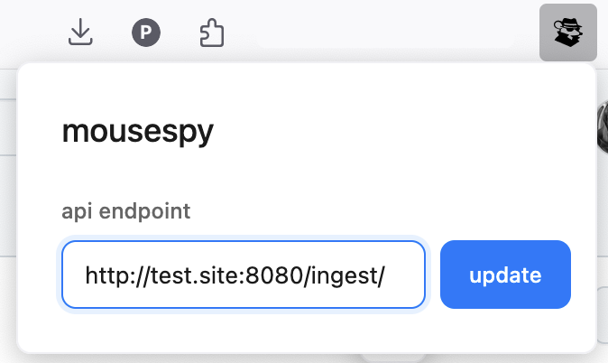
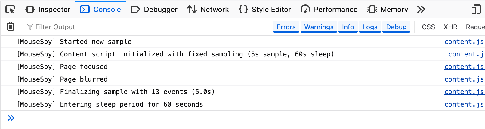

# MouseSpy

Firefox and Chrome extensions to sample mouse movement data and sent it to user configured endpoint for research purposes.

## Images





## Output Schema

The extension sends data in the following JSON format:

```json
{
  "userId": "string",
  "mouseData": [
    {
      "timestamp": "ISO 8601 datetime string",
      "type": "string",
      "domain": "string", 
      "viewportWidth": "number",
      "viewportHeight": "number",
      "x": "number",
      "y": "number"
    }
  ]
}
```

### Schema Details

- **userId**: Unique identifier for the user, randomly generated by extension (string)
- **mouseData**: Array of mouse interaction events
  - **timestamp**: ISO 8601 formatted datetime string (e.g., "2025-07-09T06:57:38.427Z")
  - **type**: Type of interaction (e.g., "scroll", "move", "click")
  - **domain**: Current website domain (e.g., "github.com")
  - **viewportWidth**: Browser viewport width in pixels (number)
  - **viewportHeight**: Browser viewport height in pixels (number)
  - **x**: X coordinate of the interaction (number)
  - **y**: Y coordinate of the interaction (number)

### Example Output

```json
{
  "userId": "d9dly26km5j",
  "mouseData": [
    {
      "timestamp": "2025-07-09T06:57:38.427Z",
      "type": "scroll",
      "domain": "github.com",
      "viewportWidth": 1463,
      "viewportHeight": 775,
      "x": 0,
      "y": 1
    }
  ]
}
```

